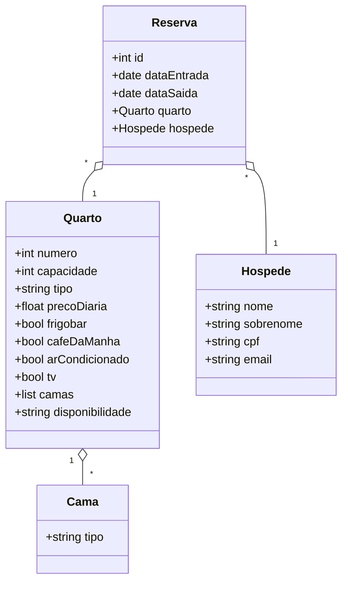

# Diagrama de Classes Principal

- **Quarto:** Representa um quarto do hotel, com atributos e lista de camas
- **Cama:** Tipo de cama presente no quarto
- **Hóspede:** Dados do hóspede
- **Reserva:** Associação entre hóspede e quarto, com datas de entrada e saída
